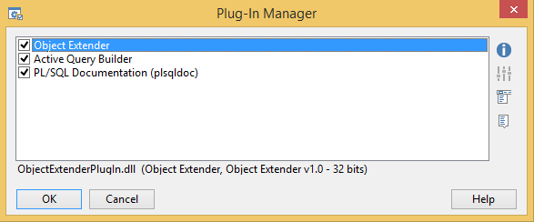
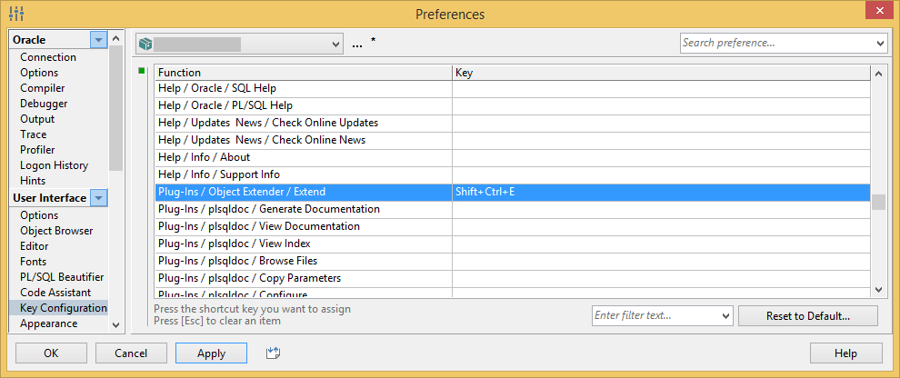
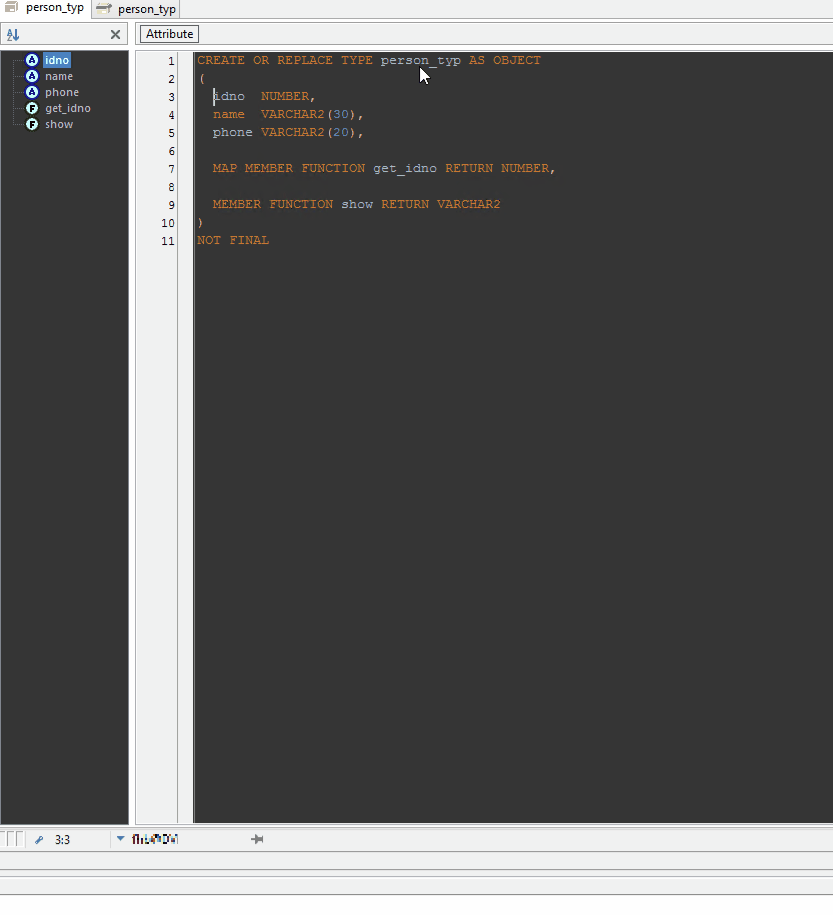

# ObjectExtender PlugIn

ObjectExtender PlugIn for PL/SQL Developerd designed to simplify subtype creation.

## Installation

Copy **ObjectExtenderPlugIn.dll** and **ObjectExtenderPlugIn.sql** files (you can find them in [Compiled](Compiled) directory) to the your PlugIn directory and restart PL/SQL Developer.

PL/SQL Developer PlugIn directory can be found in `Configure -> Preferences -> Files -> Directories -> Plug-Ins` in your PL/SQL Developer.

After installation you should see a new plugin in PlugIn Manager window (`Configure -> Plug-Ins`):

## Customization

You can configure a hot key (shortcut key) to trigger this PlugIn - go to `Configure -> Preferences -> User Interface -> Key Configuration`, find **Plug-Ins / Object Extender / Extend** function and setup a key:

## Usage

Right click:

Shortcut key:

